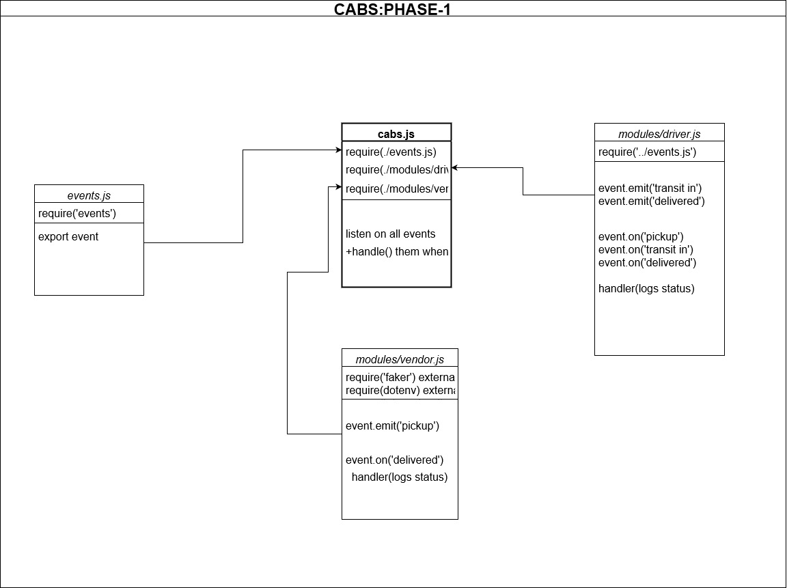

# Lab Class :11 (CABS)

## Author: Mohammad Quthama

- [submission PR](https://github.com/mohammad-qethama/CABS/pull/1)
- [tests report](https://github.com/mohammad-qethama/CABS/actions)

### Setup

#### `.env` requirements

- `STORE_NAME` : 'Saul-Goodman';

#### Dependencies

- dotenv
- faker.js

#### Devdependencies

- eslint
- jest
- rewire

#### Running the app

- `node caps.js`

#### Tests

- Unit Tests: `npm run test`
  - test for handlers :
    - `driver.test.js`
    - `caps.test.js`
  
#### UML

